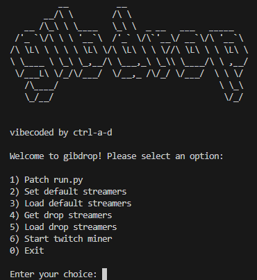

<p align="center">
  
</p>

# gibdrop

**Version: 0.0.1**

> **This project is vibecoded. Which means it might work or not work.**

A helper utility for automating and patching the [Twitch-Channel-Points-Miner-v2](https://github.com/rdavydov/Twitch-Channel-Points-Miner-v2) streamer list.

This repo contains only the following helper scripts:
- `gibdrop.py` — Interactive menu for managing streamer lists, patching, and starting the Twitch miner (via Docker or CLI).
- `get_streamer.py` — Utilities for loading, saving, and fetching streamer lists. **The drop streamer patcher is only meant for Twitch drops for the game "Rust".**
- `patch.py` — Installs dependencies and/or patches the main miner's `run.py` for custom streamer loading.

## Features
- Interactive menu for:
  - Installing dependencies only (for CLI usage)
  - Patching `run.py` only (for Docker or CLI usage)
  - Managing default and drop streamer lists
  - Switching active streamer lists
  - Starting the Twitch miner (choose Docker or CLI)
- Automatic patching of `run.py` (or creation from `example.py` or GitHub if missing)
- Ensures all dependencies (`requests`, `beautifulsoup4`) are installed (if needed)

## Usage
1. **Clone the main miner project** ([Twitch-Channel-Points-Miner-v2](https://github.com/rdavydov/Twitch-Channel-Points-Miner-v2)) and place these scripts in the same directory.
2. **Before using these scripts, make sure the main miner is working on your system (test it by running it normally first).**
3. Run the menu:
   ```bash
   python3 gibdrop.py
   ```
4. Use the menu to:
   - Install dependencies (option 1, for CLI users)
   - Patch `run.py` (option 2, for both Docker and CLI users)
   - Manage streamer lists (options 3-6)
   - Start the Twitch miner (option 7, choose Docker or CLI)

## Requirements
- Python 3.7+
- The main miner project files (see above)

## Notes
- `patch.py` will create `run.py` from `example.py` or download it from GitHub if missing.
- Only your streamer management and patching scripts are included in this repo.
- The drop streamer patcher is only for Rust Twitch drops.
- For full miner functionality, see the [main project](https://github.com/rdavydov/Twitch-Channel-Points-Miner-v2).
